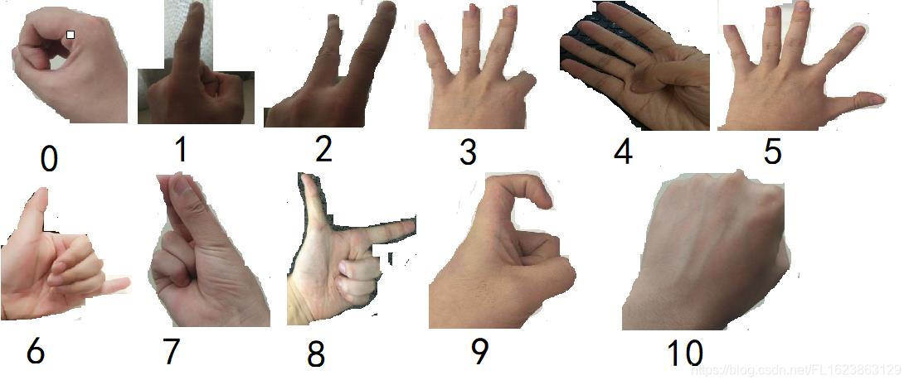
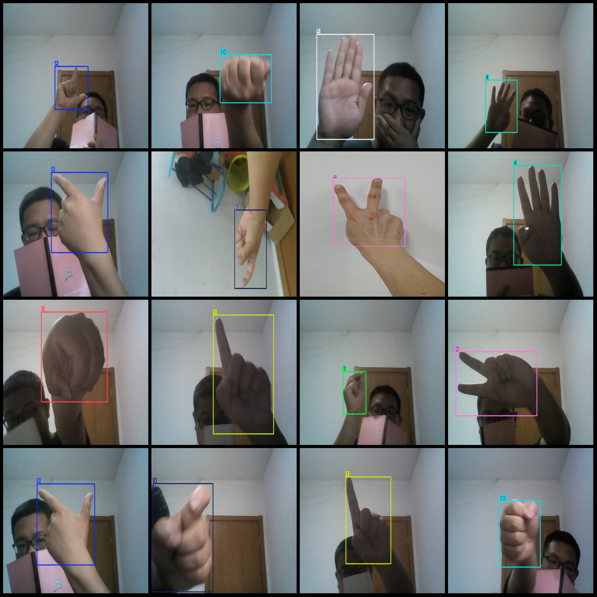
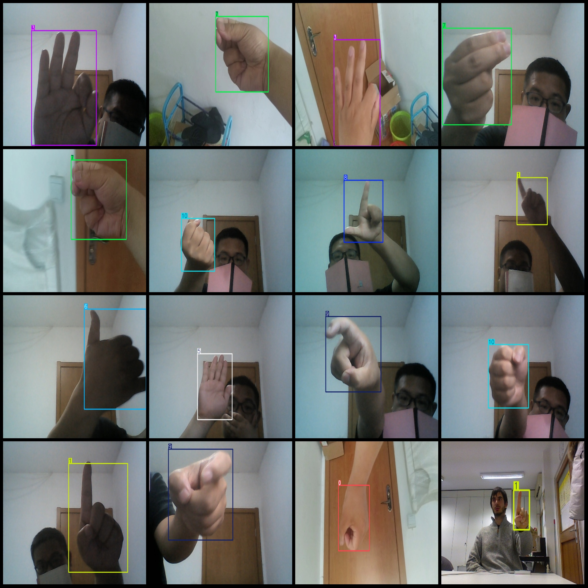

# Digital Gesture Recognition 0-9 Detection Dataset, VOC+YOLO format, 8738 images, 10 categories

The dataset can detect 10 types of digital gestures, as shown in the figure below:

For access to the dataset, please follow the WeChat public account "Future Autonomous Research Center" (dataset is paid).

0 represents a circle formed by your thumb and index finger.
1 represents your index finger during summer.
2 represents a victory sign.
3 represents a similar OK gesture.
4 represents other fingers raised except for the thumb.
5 represents all fingers raised.
6 represents a common expression like "666."
7 represents a feeling that money is about to be earned.
8 represents a gun pose.
9 represents a nose rubbing gesture.
10 represents a closed fist.

The format of the dataset includes Pascal VOC and YOLO formats (excluding the split path's txt files, only including jpg images and corresponding VOC format xml files and yolo format txt files), with 
8738 images in total. The number of annotation files (xml files) is also 8738, and the number of annotation files (txt files) is also 8738. The number of annotation categories is 11. The number of 
labeled boxes per category is as follows:

- 0: 775 boxes
- 1: 682 boxes
- 2: 759 boxes
- 3: 785 boxes
- 4: 720 boxes
- 5: 926 boxes
- 6: 470 boxes
- 7: 848 boxes
- 8: 706 boxes
- 9: 1366 boxes
- 10: 752 boxes

Total box count: 8789
Image resolutions include multiple resolutions such as 400x300, 640x480, etc.
Annotation tools used: labelImg
Annotation rules: draw a box around the category.
Important note: The dataset does not have been divided into training, validation, or test sets; users are required to partition them themselves.
Special declaration: This dataset does not guarantee any accuracy of trained models or weight files.
Image preview:
## Images

Here is a pay link on Stripe ( https://buy.stripe.com/3cs8yP7sY87d0vu9AB ). Please contact me lonlonago@foxmail.com after funding $89, and I will send you a complete data files , thank you!

